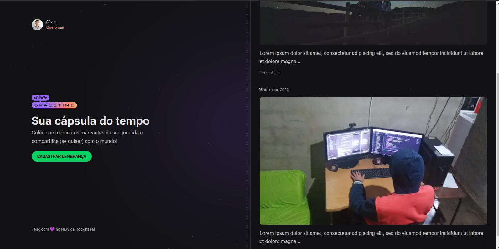

 <p align='center'></p>

 <p align='center'>


 
</p>

## 🚀 Tecnologias
Esse projeto está utilizando as seguintes tecnologias:
    

- [React](https://pt-br.reactjs.org/)
- [Node](https://nodejs.org/en/)
- [Typescript](https://www.typescriptlang.org/)  
- [Next](https://nextjs.org//)  
- [ReactNative](https://reactnative.dev/)  
- [Expo](https://expo.dev/)  


## ⚙️ Funcionalidades
- Cadastro e login através da API do Github;
- Criar novas memórias;
- Listar memórias;
- Envio de imagem para capa da memória;

## 🎲 Como utilizar
### Clone esse repositório
```bash
git clone https://github.com/Savio-Anjos/nlw-Spacetime.git

```
### Navegue até o diretório backend
```bash 
cd server
```

### Instale as dependências
```bash
npm i
```
```bash
yarn
```

### Inicie o servidor
```bash
yarn dev
npm run dev
```

### Navegue até o diretório frontend
```bash 
cd web
```

### Instale as dependências
```bash
npm i
```
```bash
yarn
```
### Inicie a aplicação Web
```bash
yarn dev
npm run dev
```

### Navegue até o diretório mobile
```bash 
cd mobile
```

### Instale as dependências
```bash
npm i
```
```bash
yarn
```
### Inicie a aplicação mobile
```bash
yarn start
npm start
```

## 🖼️ Layout


---
<p>Criado com 💙 por <a href='https://github.com/Savio-Anjos/' target='_blank'>Sávio Anjos</a></p>


 
